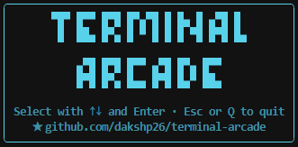
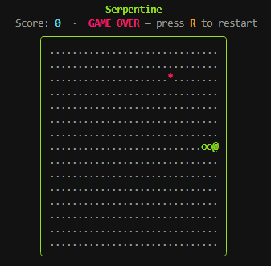
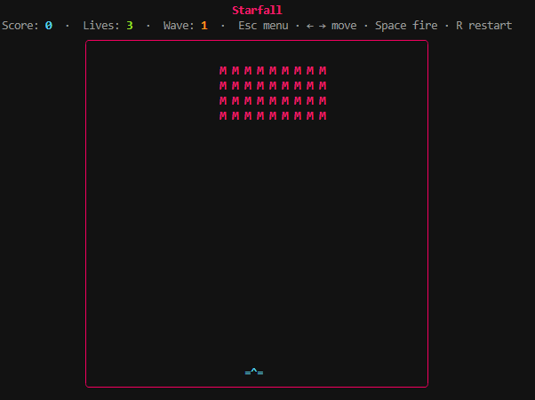
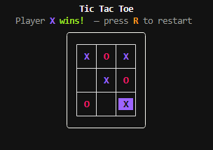
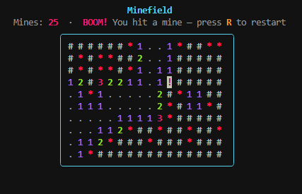
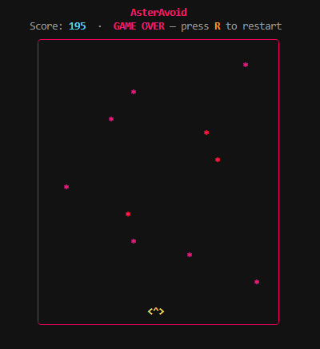
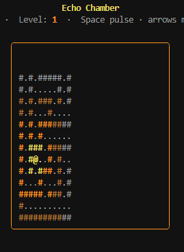

<div align='center'>

# Terminal Arcade
**Play games in the terminal while your coding agents run**



</div>

<p align="center">
  <a href="https://github.com/dakshp26/terminal-arcade"></a>
  
  <a href="https://github.com/Textualize/textual"></a>
  <a href="https://github.com/astral-sh/ruff"></a>
</p>

<div align="center">
Play classic arcade games straight from your terminal. No browser, no GUI, just Python.
Built with <a href="https://github.com/Textualize/textual">Textual</a> and <a href="https://github.com/Textualize/rich">Rich</a> for smooth keyboard input, live rendering, and zero latency.
It's an open playground for learning terminal UI development. Explore the code, tinker with it, and build your own games.
</div>

<p></p>

<div align="center">
If you find it fun and interesting, consider giving it a ⭐. It helps others discover the project.
</div>

---

## Requirements

- Python 3.13+
- [uv](https://github.com/astral-sh/uv) (recommended) — or pip

## Quickstart

```bash
git clone https://github.com/dakshp26/terminal-arcade.git
cd terminal-arcade
uv sync
uv tool install . --with-requirements requirements.txt
```

You're all set — `terminal-arcade` is now available from any CLI and directory on your system. Happy arcading!

**New games dropped?** Pull and reinstall:

```bash
git pull
uv tool install . --with-requirements requirements.txt
```

---

## Games

<table>

<tr>
<td align="center" width="25%">

### Serpentine


Steer a growing snake around the screen to eat food. Avoid hitting walls or your own tail.

</td>
<td align="center" width="25%">

### Starfall


Pilot an ASCII ship at the bottom of the screen, blasting waves of descending alien craft before they reach you.

</td>
<td align="center" width="25%">

### Tic Tac Toe


Two-player classic. Take turns placing X and O; first to line up three in a row wins.

</td>
<td align="center" width="25%">

### Minefield


Uncover a grid hiding 25 mines using numbered clues. Flag every mine without triggering one.

</td>
</tr>

<tr>
<td align="center" width="25%">

### AsterAvoid

Pilot a spacecraft across the bottom and dodge a relentless barrage of accelerating asteroids falling from above.
</td>
<td align="center" width="25%">

### Echo Chamber

Navigate a pitch-dark cave as a bat(@) — pulse sonar(space) to illuminate your surroundings, reach the exit(>) before your echo fades and the cave bats(*) find you.
</td>
</tr>
</table>

### More on the way...

The arcade is still being built. More games are queued up and dropping soon — stay tuned by watching and starring the repo (or better yet, contribute one).

---

## General Game Controls

| Action   | Keys                        |
|----------|-----------------------------|
| Move     | Arrow keys / WASD / hjkl    |
| Secondary Action    | Space / ↑ / W               |
| Restart  | R                           |
| Menu     | Esc                         |
| Quit     | Ctrl+C                      |

---

## Project Structure

```
terminal_games/
├── app.py               # App root (Textual)
├── screens/
│   └── menu.py          # Game selection menu
└── games/
    ├── protocol.py      # TerminalGame interface
    ├── registry.py      # Game registry
    ├── serpentine/      # each: model.py (logic), screen.py (TUI)
    ├── starfall/
    ├── tictactoe/
    ├── minefield/
    ├── asteravoid/
    └── echo_chamber/
```

Game logic (`model.py`) is kept free of Textual/Rich imports so it stays independently testable.

---

## Adding a New Game

1. Create `terminal_games/games/<name>/` with `model.py` and `screen.py`.
2. Implement the `TerminalGame` protocol — `game_id`, `title`, `description`, `build_screen()`.
3. Register it in `terminal_games/games/registry.py` → `get_games()`.

That's it. The menu picks it up automatically.

---

## Development

### Setup

```bash
git clone https://github.com/dakshp26/terminal-arcade.git
cd terminal-arcade
uv sync
uv run main.py
```

Or with pip:

```bash
pip install textual rich
python main.py
```

### Test and Lint Commands

```bash
# Run tests
uv run pytest

# Lint
uv run ruff check .

# Format
uv run ruff format .
```

---

## Contributing

Contributions are welcome. To add a game, fix a bug, or improve the TUI:

1. Fork the repository
2. Create a feature branch: `git checkout -b feat/my-game`
3. Make your changes and add tests
4. Open a pull request

Please keep game logic (model) free of UI imports so tests stay fast and framework-independent.

All contributions will be licensed under the license terms.

---

## License

See [LICENSE](LICENSE) for details.

This project is intended for personal and educational use only. It is not permitted to use this project for commercial purposes. The sole intention of this project is to showcase the development of terminal based games using python and open source libraries.
